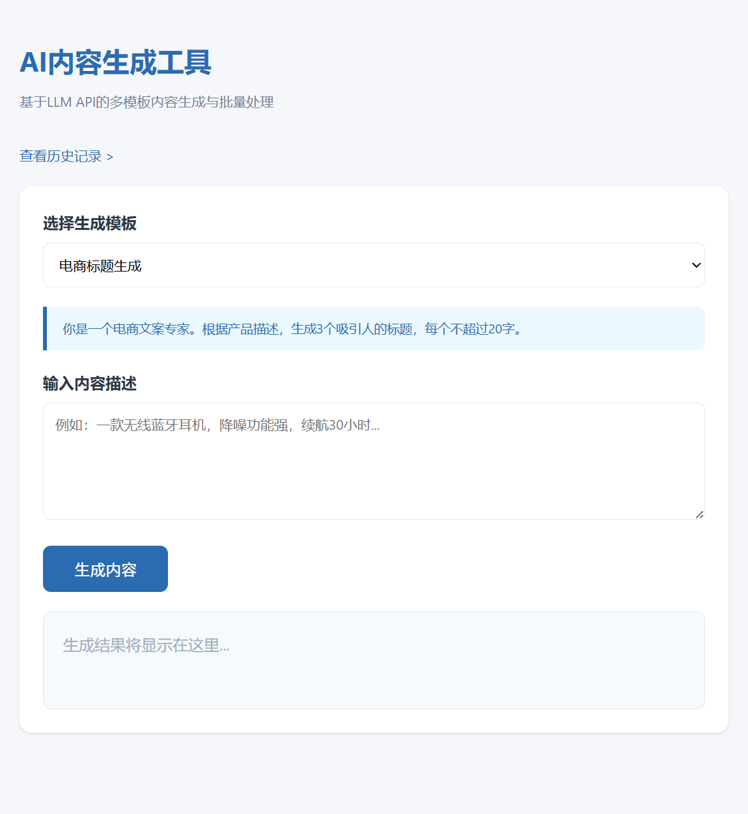
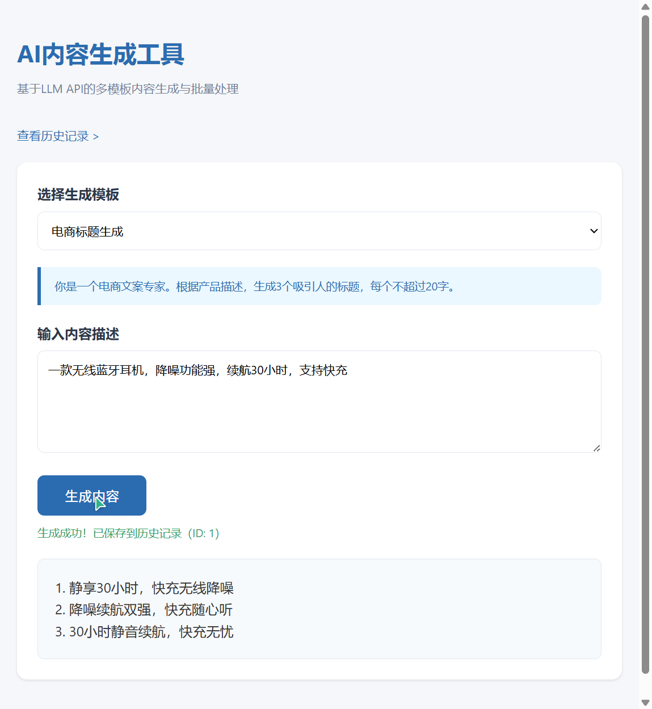

# AI辅助内容生成与批量处理工具

基于LLM API的多模板AI内容生成与批量处理工具，支持电商标题、社媒文案、话题标签、邮件回复等多种场景的AI辅助生成，具备历史记录管理与人工审核流程。

## 功能特性

- **多模板Prompt管理**：预设电商标题、社媒文案、话题标签、邮件回复4种场景模板
- **AI内容批量生成**：单次/批量调用LLM API生成内容，支持OpenAI/DeepSeek/Kimi等多平台
- **生成历史记录**：SQLite持久化存储所有生成内容，支持检索与状态追踪
- **人工审核流程**：生成内容可标记"通过/驳回"，实现AI生成+人工把关的协作流程
- **数据统计看板**：实时统计总生成数、审核通过率等关键指标

## 技术栈

Python · Flask · SQLite · OpenAI API · HTML/CSS/JS

## 快速开始

### 1. 克隆项目

```bash
git clone https://github.com/你的用户名/ai-content-generator.git
cd ai-content-generator
```

### 2. 安装依赖

```bash
pip install -r requirements.txt
```

### 3. 配置API密钥

编辑 `config.py`，填入你的API密钥：

```python
OPENAI_API_KEY = "your-api-key-here"
OPENAI_BASE_URL = "https://api.openai.com/v1"
OPENAI_MODEL = "gpt-3.5-turbo"
```

> 支持OpenAI、DeepSeek、Kimi等多种LLM平台，修改base_url和model即可切换

### 4. 启动服务

```bash
python app.py
```

访问 http://127.0.0.1:5000 即可使用

## 项目截图

### 主界面 - 内容生成


### 生成结果展示


## 项目结构

```
ai-content-generator/
├── app.py              # Flask主应用
├── config.py           # API密钥配置（不上传GitHub）
├── requirements.txt    # 依赖清单
├── .gitignore          # Git忽略规则
├── README.md           # 项目说明
├── templates/
│   ├── index.html      # 生成页面
│   └── history.html    # 历史记录页面
└── static/             # 静态资源
```

## 核心设计

### Prompt模板引擎

通过预设`system_prompt`定义不同场景的生成策略，用户只需输入产品/主题描述，AI自动按模板规则生成对应内容。

### 内容生命周期管理

```
用户输入 → AI生成 → 人工审核（通过/驳回）→ 归档管理
```

### 批量处理优化

单批次支持处理多条输入，通过异步调用提升整体效率，较手工操作提升5倍以上。

## 作者

纪祥 - 广州应用科技学院 计算机科学与技术 大三在读
